### 一、电脑端基本设置

##### 1.打开 热点

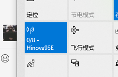

##### 2.右键 网络图标(连接wifi需要点击的那个小图标) 选择 打开网络和internet设置

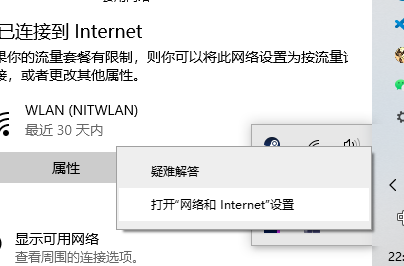

##### 3.选择 更改适配器选项

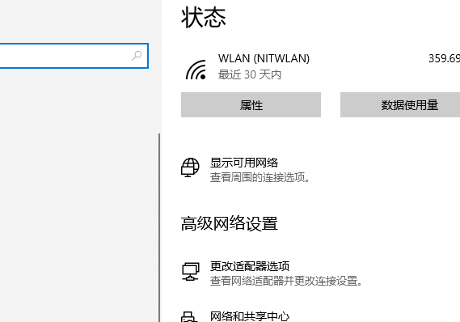

##### 4.右键 WLAN 选择 状态

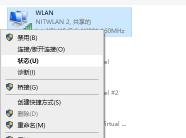

##### 5.点击 属性

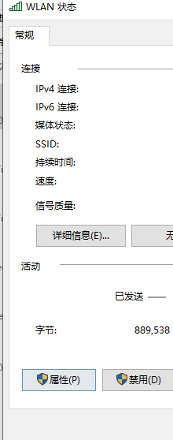

##### 6.选择 共享

##### 7.勾选 允许其他网络用户通过此...来共享

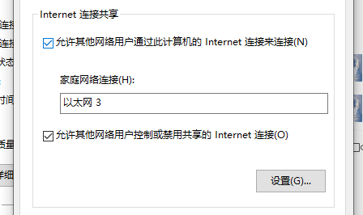

##### 8.家庭网络连接 选择 热点所在(本地连接**2一类)*

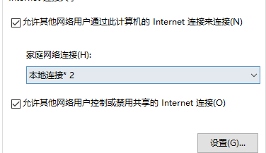

##### 9.（热点所在网络 一般为本地连接*2）可在之前的更改适配器页面, 通过关开热点查看来确定.

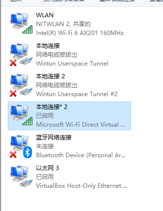

## 二、Clash配置

##### 1.启用配置中的 局域网连接 和 TUN连接 

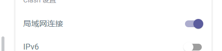

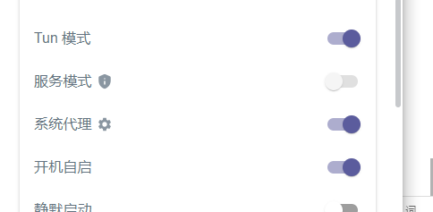

##### (记得正常启用clash --打开 系统代理 )

## 三、手机端设置

##### 1.选择连接电脑热点 (如果直接连接, 选择删除热点, 重新连接)

##### 2.选择热点连接设置中的代理 - 手动 

##### 3.在电脑端 开机界面输入 cmd 查看 命令提示符

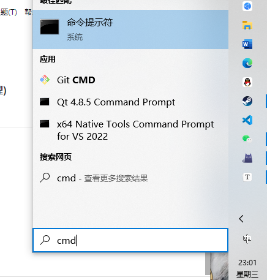

##### 4.在其中输入 命令 ipconfig

##### 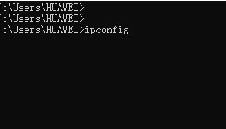

##### 5.找到 无线局域网适配器 的 Ipv4 地址

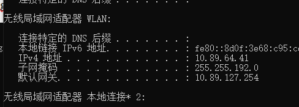

##### 6.在手机代理的 服务器主机名 中输入 上方ipv4地址

##### 7.服务器端口 输入 7890

##### 8.输入密码 连接, 检查是否成功代理(浏览外网)
