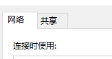

### 一、电脑端基本设置

##### 1.打开热点

##### 2.右键网络图标选择 打开网络设置

##### 3.选择更改适配器选项

##### 4.右键WLAN 选择状态

##### 5.点击属性

##### 6.选择共享

##### 7.选择允许共享

##### 8.家庭网络连接选择热点所在(本地连接**2一类)*

##### 9.（热点所在网络 一般为本地连接*2）可在通过关开热点查看来确定.

## 二、Clash配置

##### 1.启用配置中的局域网连接和TUN连接

##### (记得正常启用clash --打开系统代理)

## 三、手机端设置

##### 1.选择连接电脑热点 (如果直接连接, 选择删除热点, 重新连接)

##### 2.选择热点连接设置中的代理 - 手动 

##### 3.在电脑端 开机界面输入cmd 查看命令提示符

##### 4.在其中输入 命令ipconfig

##### 

##### 5.找到无线局域网适配器的Ipv4地址

##### 6.在手机代理的服务器主机名中输入上方ipv4地址

##### 7.服务器端口 输入7890

##### 8.输入密码 连接, 检查是否成功代理(浏览外网)
